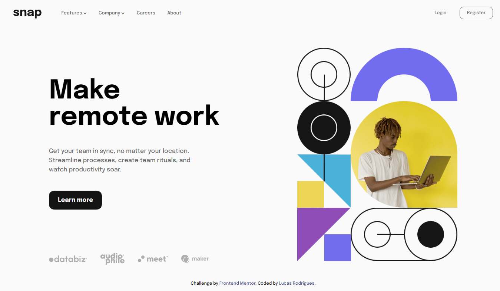
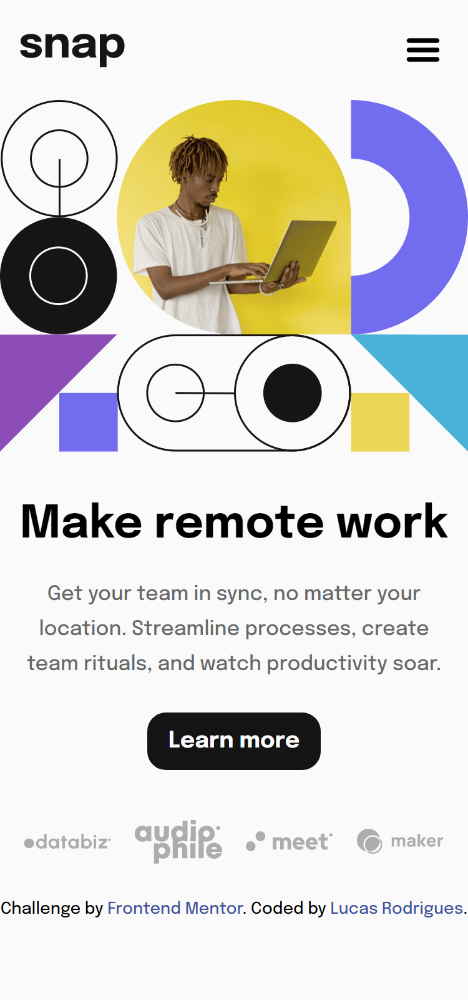
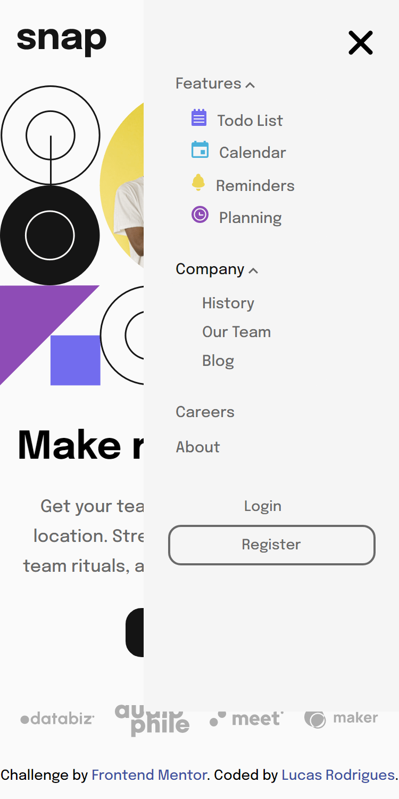

# Frontend Mentor - Intro section with dropdown navigation solution

## Overview

### The challenge

Users should be able to:

- View the relevant dropdown menus on desktop and mobile when interacting with the navigation links
- View the optimal layout for the content depending on their device's screen size
- See hover states for all interactive elements on the page

### Screenshot

  

     

### Links

- Live Site URL: [Live site URL]()

### Built with

- Semantic HTML5 markup
- CSS custom properties
- Flexbox
- JavaScript

## Author

- Website - [Lucas](https://portfolio-lucasrodrigues.netlify.app/)
- LinkedIn - [LinkedIn Lucas](https://www.linkedin.com/in/lucas-rodrigues-perfil/)

